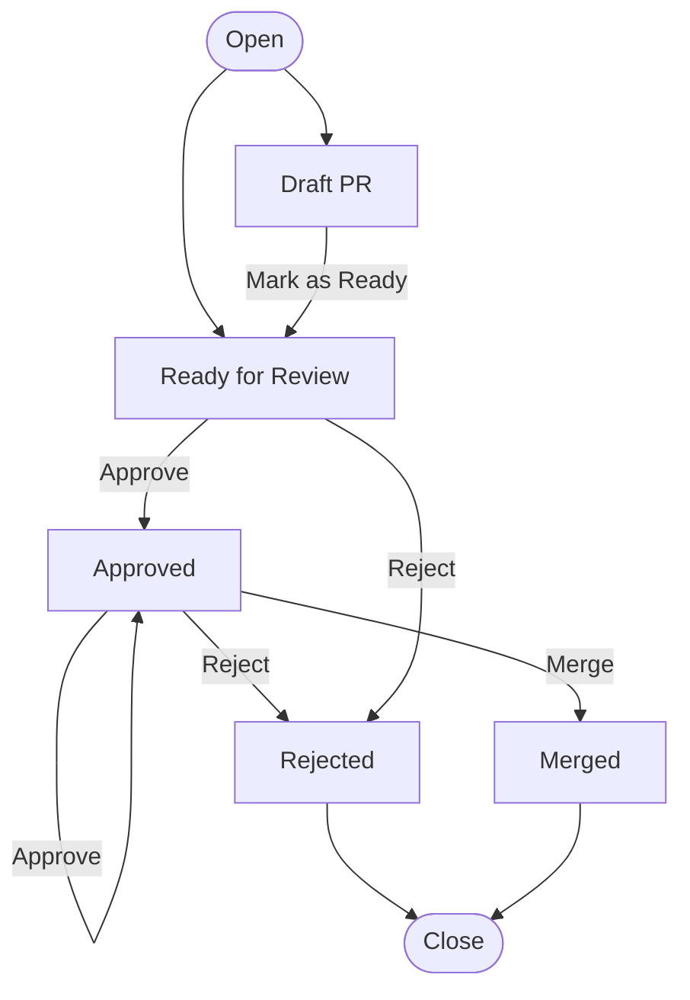

Typestate
=========

The typestate pattern encodes state into type information.

Let's imagine we want to represent a Pull Request. The request might be opened immediately ready for review, or opened
as a draft, moving to ready for review later. Once ready for review, the PR needs to receive one or more approvals after
which it can be merged. If after being made ready for review, the PR receives a rejection, the PR is considered to be
Rejected, even if it's previously been approved.

This is a simplified model but is complex enough to show the benefits of TypeState.



Let's try to model one small part of this flow in a traditional way, the "approve" action.

First lets model it with a PullRequest type that _has_ a status. A PR can be approved if the status is ReadyForReview or
Approved. If the status was not one of those, then we'll need to return an error to say that the status could not be
changed.

```rust
struct InvalidStateError;

#[derive(PartialEq)]
enum Status {
    Draft,
    ReadyForReview,
    Approved,
    Rejected,
    Merged
}

struct PullRequest {
    status: Status,
    // ...other PR details ...
}

impl PullRequest {
    fn approve(&mut self) -> Result<(), InvalidStateError> {
        if self.status == Status::ReadyForReview || self.status == Status::Approved {
            self.status = Status::Approved;
            Ok(())
        } else {
            Err(InvalidStateError)
        }
    }
}
# 
# fn main () {
// You can approve a PR with Ready for Review or already Approved
let mut pr = PullRequest { status: Status::ReadyForReview };
assert!(pr.approve().is_ok());
assert!(pr.approve().is_ok());

// You can not approve a rejected PR, but you need to handle the error
pr.status = Status::Rejected;
assert!(pr.approve().is_err());
# }
```

We can conceptually understand that a PR has a state, but this then adds complexity to our logic when we want to change
that state if there are rules around how it can change.

If instead we understand a PRs as being in different states, this can reduce the logical complexity.


```rust
struct PullRequestReadyForReview {
    // ...other PR details ...
}

struct PullRequestApproved {
    // ...other PR details ...
}

struct PullRequestRejected {
    // ...other PR details ...
}


impl PullRequestReadyForReview {
    fn approve(self) -> PullRequestApproved {
        PullRequestApproved {
            // ... move self into PullRequestApproved ...
        }
    }
}

impl PullRequestApproved {
    fn approve(self) -> PullRequestApproved {
        self
    }
}


# 
# fn main () {
// You can approve a PR with Ready for Review or already Approved
let ready_pr = PullRequestReadyForReview { };
let approved_pr = ready_pr.approve();
let still_approved = approved_pr.approve();

// The `.approve()` method doesn't exist for rejected PRs, commented line won't compile
let rejected_pr = PullRequestRejected { };
// rejected_pr.approve();
# }
```

Pros and Cons
-------------

Utilising the typestate pattern requires writing a lot more code _but_ that code has fewer branches, fewer (or in this 
case no) potential error states, and everything is logically subdivided making maintaining the code more trivial.

In the example we've given here, we consume the type each time we change state. Generally in Rust it's better to pass
references rather than ownership, but in the case of transitioning state we want to return a new type. Often the old
type will contain owned data that needs to be moved to the new type, and we'll rarely want to keep the old state around
but your needs may differ.

